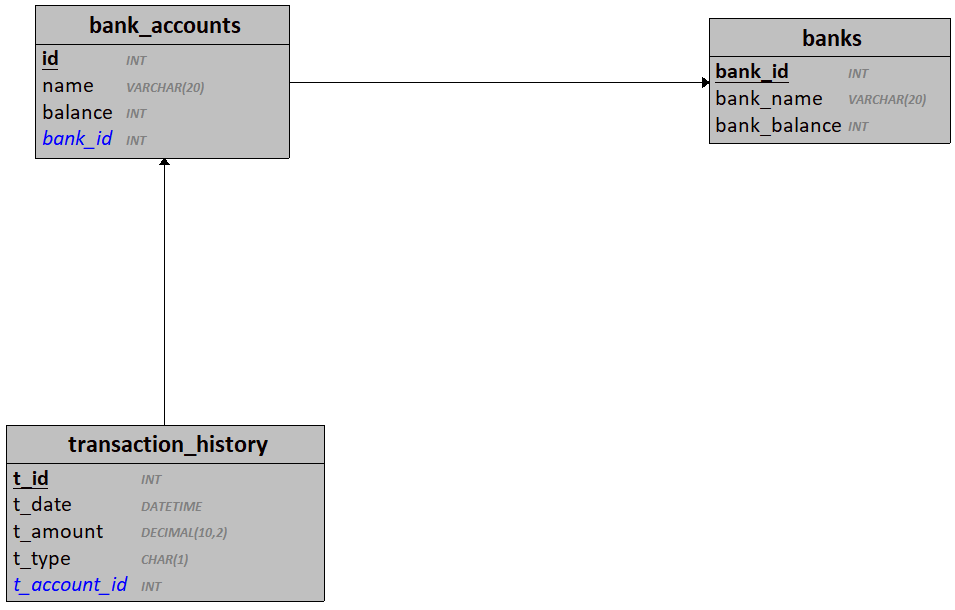
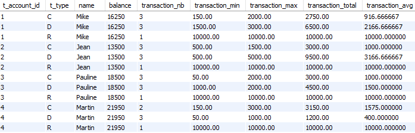

# Bank Accounts 

Objectif : Analyser un système existant et le faire évoluer selon un cahier des charges.

## Contexte actuel 

Le système actuel référence des banques et les comptes bancaires associés.

Un compte bancaire ne peut pas voir son solde descendre sous 0 (aucun découvert autorisé).

Le système permet le transfert de fonds entre les différents comptes bancaires enregistrés.

Chaque transaction entre les comptes bancaires et enregistrée dans un journal (transaction_history).

### État du système actuel 

## Scénarios à implémenter 

1. Le système doit enregistrer les crédits dans le journal
    - Créer une procédure stockée permettant de créditer un montant à un compte bancaire existant
    - Chaque crédit doit être enregistré avec le type "C"
---
2. Le système doit enregistrer les débits dans le journal
    - Créer une procédure stockée permettant de débiter un montant à un compte bancaire existant
    - Chaque débit doit être enregistré avec le type "D"
        - Si le débit échoue (solde du compte insuffisant), il est enregistré avec le type "E"
---    
3. Le système doit enregistrer les demandes de prêts (type crédit à la consommation)
    - pour chaque prêt, on connait la date de la demande, le montant restant à payer et la durée en mois
    - un client peut contracter un unique prêt auprès de sa banque
    - un prêt peut avoir 3 états :
        - "A" : le prêt est en attente de la décision de la banque
        - "N" : le prêt a été refusé
        - "Y" : le prêt a été accepté
    - à l'ajout (insert) d'un nouveau prêt, il est obligatoirement en état "attente"
    - une mise à jour (update) d'un prêt existant permet de modifier l'état du prêt en accepté ou refusé uniquement
    - le montant d'un prêt doit être compris entre 1000€ et 100000€
    - lorsqu'un prêt est accepté, un taux d'intérêt est renseigné et le compte bancaire associé est directement crédité du montant du prêt
--- 

## Travail à réaliser 

Analyser le système bancaire existant.

Établissez le dictionnaire des données associé.

Implémentez les scénarios ci-dessous (Fonctionnalités, Requêtes et Taxes)

Vous n'êtes pas obligés de les faire dans l'ordre, analyser l'ensemble et déterminez dans quel ordre vous allez réaliser les différents scénarios.

Vous disposez :
- du script SQL de création de la base de données
- des diagrammes conceptuels et logiques associés

### Fonctionnalités

Créer un script .SQL
- votre script ne doit pas compromettre les données existantes

1. Ajouter la gestion des crédits
    - Créer les procédures stockées et/ou déclencheurs nécessaires
    ---
2. Ajouter la gestion des débits
    - Créer les procédures stockées et/ou déclencheurs nécessaires
    ---
2. Ajouter la gestion des virements entre comptes
    - Créer les procédures stockées et/ou déclencheurs nécessaires
    ---
3. Ajouter la gestion des prêts
    - Modifiez le MCD
    - Créer la/les table(s) nécessaire(s)
    - Créer les procédures stockées nécessaires
        - Demander un prêt
        - Accepter ou refuser un prêt
        - Débiter tous les comptes associés à un prêt dont le restant à payer est supérieur à zéro du montant de la mensualité associée 
            - la mensualité est calculée à partir du montant du prêt, de la durée et du taux d'intérêts:
                - Soit "M" le montant du prêt
                - Soit "D" la durée du prêt en mois
                - Soit "T" le taux d'intérêt en pourcentage
                - `Mensualité = (M/D) + ( (M/D) * (T/100) )`
            - le restant à payer du prêt est mis à jour : 
                - Soit "M" le montant du prêt
                - Soit "D" la durée du prêt en mois
                - Soit R le restant à payer actuel
                - `R = R - (M/D)`
            - si le restant à payer est inférieur à la mensualité, adapter le calcul : 
                - `Mensualité = R`
                - `R = 0`
            - si le débit échoue, 1 mois est ajouté à la durée du prêt et le restant à payer est augmenté de 50€
---

Un jeu d'essai cohérent doit être fourni dans un script "Banks_v2_data.sql"

### Requêtes SQL

Dans un script SQL distinct, créez les scénarios suivants :

1. Afficher tous les débits des comptes d'une banque en particulier
---
2. Afficher le montant total des transactions
---
3. Afficher le montant total de chaque type de transaction
---
4. Afficher le total de revenus enregistrés pour chaque compte
---
5. Afficher le montant moyen des virements
---
6. En une instruction, afficher pour chaque compte et pour chaque type de transaction:
    - L'identifiant du compte
    - Le nom du compte
    - Le solde du compte 
    - Le nombre de transactions
    - Le montant de la transaction la plus petite
    - Le montant de la transaction la plus élevée
    - Le montant total des transactions
    - le montant moyen des transactions

Exemple de résultat attendu : 

---

7. En une instruction, afficher pour chaque banque :
    - L'identifiant de la banque
    - Le nom de la banque
    - Le solde de la banque
    - Le nombre de comptes associés
    - Le solde total des comptes associés
    - Le solde moyen des comptes associés
    - Le nom et le solde du compte associé le plus riche
    - Le montant de la transaction la plus petite
    - Le montant de la transaction la plus élevée
    - Le montant total de toutes les transactions
    - le montant moyen de toutes les transactions
    - Le montant moyen des prêts acceptés
    - Le montant total du restant à payer des prêts acceptés

---

## Les taxes 

Chaque transaction est taxée d'un montant égal à 1€. 
Cela signifie que lors d'une transaction, 1€ est prélevé du montant de la transaction puis directement ajouté au solde de la banque associée.
